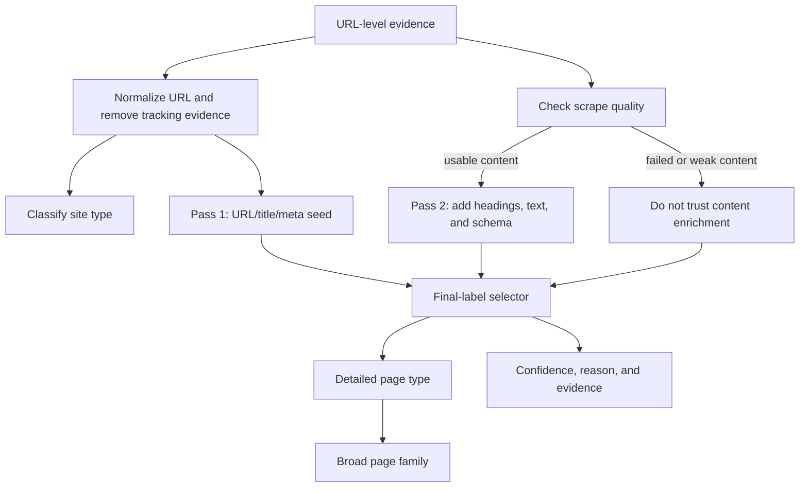

# General Page Taxonomy Rule v2

## Purpose

This document explains how CiteScope classifies a website and an individual webpage. The current classifier is deterministic and rule-based. It does not call an LLM, use embeddings, learn from citation outcomes, or use a trained machine-learning model.

Rule v2 is currently an additive preview. Historical taxonomy columns remain unchanged so that existing notebooks and econometric outputs are reproducible.

Implementation:

- `src/econometrics_eda_v2/general_page_taxonomy.py`
- `src/econometrics_eda_v2/general_page_taxonomy_pipeline.py`
- `src/econometrics_qa.py`

Rule version: `general_page_taxonomy_v2`

## Two Separate Questions

The taxonomy deliberately separates two concepts:

1. `site_type_general`: What kind of website or publisher is this?
2. `page_type_general`: What function does this particular webpage perform?

For example, a property marketplace is a `marketplace_or_platform`, while one page on it may be a `listing_page`, another may be a `guide_article`, and another may be a `search_results_page`.

`page_type_family_general` maps the detailed page type into a broader family suitable for descriptive analysis.

## Classification Flow



## Allowed Evidence

The classifier may use:

- Normalized source URL
- URL path and functional query parameters
- Root domain
- Page title
- Meta description
- H1 or extracted headings
- Extracted page-text excerpt
- Structured-data types such as `Article`, `Product`, `ItemList`, and `FAQPage`
- Scrape/content quality
- Existing broad site-role metadata as an optional fallback

The classifier must not use:

- `cited` or any citation label
- Citation rate
- Prompt text
- Answer text
- Answer similarity or answer overlap
- Source position or observed rank
- Domain citation statistics

These exclusions prevent outcome leakage into the taxonomy.

## URL Handling

Rule v2 classifies the page route rather than the hostname text.

For example:

```text
https://amazingproperties.org/blogs/market-outlook?utm_source=chatgpt.com
```

The word `properties` in the hostname is not allowed to turn the page into a listing. The `/blogs/` route can support `blog_article`, and `utm_source` is ignored.

Only functional query keys such as `q`, `query`, `search`, `keyword`, `filter`, and `category` are retained as classification evidence. Pagination and tracking parameters do not independently create a search-results label.

## Site-Type Classification

`site_type_general` is assigned primarily from the root domain and known platform signals. It is a first-match deterministic classification, not an evidence-scored page classification.

| Site type | Main signals |
|---|---|
| `official_company_or_brand` | Explicit official-site evidence or an unambiguous legacy official/company role |
| `official_organization` | Reserved for an identifiable official organization |
| `government` | Government suffixes such as `.gov`, `.go.th`, or equivalent domain structure |
| `education` | Education suffixes such as `.edu` or `.ac.th` |
| `research_or_academic` | Known academic sources such as arXiv, PubMed, JSTOR, DOI, or ResearchGate |
| `news_media` | Known news role or news/media domain evidence |
| `blog_or_content_site` | Blog, insight, story, or article publisher evidence |
| `ecommerce_store` | Store/shop domain evidence |
| `marketplace_or_platform` | Known marketplaces such as property, travel, or commerce platforms |
| `directory_or_listing_platform` | Directory, listing, or classifieds platform evidence |
| `review_platform` | Known review platforms or an unambiguous review-site role |
| `social_or_forum` | Reddit, Pantip, Facebook, Instagram, Quora, and similar platforms |
| `video_platform` | YouTube, TikTok, Vimeo, and similar platforms |
| `documentation_or_developer_site` | Documentation, API, developer, Swagger, or Postman evidence |
| `map_or_location_platform` | Google Maps, OpenStreetMap, Waze, and similar platforms |
| `file_or_document_host` | PDF routes and document/file-hosting domains |
| `unknown` | No sufficiently reliable site-role rule matched |

An `unknown` site type does not imply an unknown page type. A page route can still provide enough evidence to classify the webpage.

## Page Families and Detailed Types

| Page family | Detailed page types |
|---|---|
| `landing_or_brand_page` | `homepage`, `landing_page`, `about_page`, `brand_page`, `campaign_page` |
| `informational_content` | `blog_article`, `guide_article`, `educational_article`, `evergreen_content`, `glossary_or_definition_page` |
| `news_or_press` | `news_article`, `press_release`, `announcement_page` |
| `commercial_product_or_service` | `product_page`, `service_page`, `solution_page`, `feature_page`, `product_category_page`, `collection_page`, `promotion_page` |
| `pricing_or_package` | `pricing_page`, `package_page`, `plans_page`, `fees_page` |
| `directory_or_listing` | `listing_page`, `category_listing_page`, `directory_page`, `marketplace_listing_page`, `profile_page` |
| `search_or_results` | `search_results_page` |
| `comparison_or_review` | `review_page`, `comparison_page`, `best_of_listicle`, `ranking_page`, `testimonial_page`, `case_study` |
| `support_or_help` | `faq_page`, `help_center_article`, `support_page`, `troubleshooting_page`, `documentation_page`, `api_docs_page` |
| `contact_or_location` | `contact_page`, `location_page`, `branch_page`, `map_or_directions_page`, `appointment_or_booking_page` |
| `trust_about_or_legal` | `privacy_policy`, `terms_page`, `legal_page`, `compliance_page`, `security_page` |
| `transactional_or_account` | `login_page`, `signup_page`, `checkout_page`, `cart_page`, `payment_page`, `account_page` |
| `document_or_media` | `pdf_document`, `report_document`, `brochure_document`, `video_page`, `image_gallery_page`, `downloadable_resource` |
| `social_or_user_generated` | `forum_thread`, `social_post`, `comment_thread`, `community_page` |
| `unknown` | `unknown` |

Not every declared detailed type currently has an automatic production rule. Reserved types remain in the taxonomy so that later rules or manual labels can use a stable vocabulary. The classifier must not force a reserved type without evidence.

## Primary Page Rules

The following table summarizes the strongest route and metadata signals.

| Page type | Typical strong signals |
|---|---|
| `homepage` | Root routes such as `/`, `/home`, `/th`, or `/en` |
| `about_page` | `/about`, `/about-us`, `/company`, `/our-story` |
| `landing_page` | `/landing`, `/campaign`, `/lp`, `/get-started` |
| `blog_article` | `/blog/`, `/posts/`, `/read/`, `/content/`, `/articles/`, `/insights/`, `/knowledge/`, and other editorial routes |
| `guide_article` | `/guide/`, `/how-to/`, `/tips/`, `/checklist/`, `/neighborhoods/`, `/areas/`, or an explicit guide title |
| `news_article` | `/news/`, `/latest/`, `/media/`, explicit news metadata, or supporting `NewsArticle` schema |
| `press_release` | `/press-release/`, `/press-room/`, or an explicit press-release title |
| `product_page` | Product/item routes, product schema, or an official site's project-detail route |
| `service_page` | `/service/`, `/treatment/`, `/consulting/`, or explicit service-page metadata |
| `solution_page` | `/solution/`, `/feature/`, or explicit solution metadata |
| `pricing_page` | `/pricing`, `/price-list`, `/fees`, `/rates`, or explicit pricing-page language |
| `package_page` | `/package`, `/subscription`, or explicit service/subscription package language |
| `listing_page` | Listing/property/project-detail routes on a portal, marketplace, or broker site |
| `category_listing_page` | `/category`, `/collection`, `/new-developments`, `/our-properties`, or `ItemList` supporting evidence |
| `search_results_page` | `/search`, `/search-results`, a functional search query, or explicit search-results title |
| `directory_page` | `/directory`, `/providers`, `/doctors`, `/restaurants`, or explicit directory language |
| `review_page` | `/review`, `/testimonial`, or explicit review/rating language |
| `comparison_page` | `/compare`, `/comparison`, `/alternatives`, `/ranking`, or explicit best/top/versus language |
| `case_study` | `/case-study`, `/customer-stories`, or explicit case-study language |
| `faq_page` | Explicit FAQ route/title supported by FAQ structure or schema |
| `help_center_article` | `/help`, `/support`, `/knowledge-base`, or explicit help-center language |
| `documentation_page` | `/docs`, `/documentation`, `/reference`, `/developer`, or API-reference language |
| `contact_page` | `/contact`, `/contact-us`, `/enquiry`, or explicit contact-page language |
| `location_page` | `/location`, `/branch`, `/directions`, or explicit branch/location language |
| `appointment_or_booking_page` | `/appointment`, `/booking`, `/ibooking`, `/reserve`, `/schedule`, or explicit booking language |
| `privacy_policy` | `/privacy`, `/privacy-policy`, or an explicit privacy-policy title |
| `terms_page` | `/terms`, `/terms-and-conditions`, or an explicit terms title |
| `login_page` | `/login`, `/sign-in`, `/auth`, or an explicit login title |
| `signup_page` | `/sign-up`, `/register`, `/create-account`, or an explicit signup title |
| `checkout_page` | `/checkout` or explicit checkout language |
| `cart_page` | `/cart`, `/basket`, or explicit shopping-cart language |
| `payment_page` | `/payment`, `/pay`, or explicit payment-page language |
| `account_page` | `/account`, `/my-account`, or an explicit account-page title |
| `pdf_document` | URL path ending in `.pdf` |
| `report_document` | `/research`, `/report`, `/market-report`, `/whitepaper`, `/outlook`, or academic abstract routes |
| `downloadable_resource` | `/download`, `/brochure`, `/factsheet`, `/resources` |
| `video_page` | Known video domain or `VideoObject` supporting schema |
| `forum_thread` | Known forum/social domain |

## Site Role and Project Routes

Project routes are ambiguous across industries. Rule v2 combines the route with an independently assigned site role:

- A project/property/detail route on a portal, marketplace, or broker becomes `listing_page`.
- A project route on a developer or project-official site becomes `product_page`.
- Without a reliable site role, the classifier does not force this distinction solely from a brand or domain name.

This rule supports route segments such as `project`, `projects`, `project-detail`, `condo`, `condominium`, `property`, `room`, `unit`, `detail`, `โครงการ`, `โครงการคอนโด`, and `คอนโด`.

## Evidence Weights

The page classifier adds evidence scores by field:

| Evidence | Typical weight |
|---|---:|
| Strong PDF rule | 20 |
| Known video/social/map/documentation platform | 12-16 |
| Site role combined with a project-detail route | 10 |
| Root homepage route | 10 |
| Explicit URL route | 8 |
| Explicit title | 6 |
| Meta description | 3 |
| Heading | 3 |
| Scraped body excerpt | 1.5 |
| Structured data | 4-8 |

Body text is intentionally weaker than URL and title evidence because body text often contains navigation, related links, FAQ components, footer text, or references to other page functions.

## Structured-Data Safeguard

Structured data supports classification but usually cannot define the primary page function by itself.

For example, a project page may embed an `FAQPage` component. Rule v1 could incorrectly classify the entire project page as `faq_page`. Rule v2 assigns only four supporting points to `FAQPage`, so a strong project/listing route remains the primary function.

The same principle applies to `Article`, `Product`, `Offer`, `ItemList`, `VideoObject`, and `ContactPage` schema.

## Confidence and Abstention

After scoring all candidates, Rule v2 compares the highest and second-highest scores.

| Confidence | General condition |
|---|---|
| `high` | Score at least 12, clear score margin, and strong URL/title/domain evidence |
| `medium` | Score at least 6, positive score margin, and at least one strong evidence field |
| `low` | Weak or conflicting evidence |
| `unknown` | No candidate reaches the minimum evidence threshold |

An exact top-score tie returns `unknown` with reason `conflicting_top_scoring_rules`. It is not broken alphabetically.

The classifier preserves `unknown` when evidence is insufficient. Unknown means "not confidently classified by the available evidence," not "invalid webpage."

## Two-Pass Final Label

### Pass 1: URL seed

`page_type_url_seed_general_rule_v2` uses URL, domain role, title, and meta description. It does not use scraped body text.

### Pass 2: scraped enrichment

`page_type_scraped_enriched_general_rule_v2` adds headings, page-text excerpt, and structured data.

### Final selector

The scraped result may replace the seed only when:

1. `content_quality_flag == ok` or `content_strength` is `strong`/`medium`;
2. the scraped label is not `unknown`;
3. scraped confidence is `high` or `medium`; and
4. the seed is unknown/low confidence, or the scraped score is at least the seed score.

A failed or weak scrape cannot erase a useful URL seed. PDF rules always retain the PDF label.

## Rule v2 Output Columns

| Column | Meaning |
|---|---|
| `general_taxonomy_rule_version` | Rule implementation version |
| `site_type_general_rule_v2` | Website/source role |
| `page_type_url_seed_general_rule_v2` | URL/title/meta-only page type |
| `page_type_scraped_enriched_general_rule_v2` | Page type with usable scraped evidence |
| `page_type_general_rule_v2` | Selected final detailed page type |
| `page_type_family_general_rule_v2` | Broad family for the final page type |
| `page_type_general_confidence_rule_v2` | High, medium, low, or unknown |
| `page_type_general_source_rule_v2` | `url_seed`, `domain_rule`, `scraped_content`, `pdf_rule`, or `fallback_unknown` |
| `page_type_general_reason_rule_v2` | Evidence trail or abstention reason |

Historical columns without `_rule_v2` remain available and are not silently overwritten.

## Current Area-Condo Audit Results

Rule v2 was evaluated on 2,881 unique URLs from the area-condo / SCOPE-relevant nonbranded audit.

| Metric | Historical rules | Rule v2 |
|---|---:|---:|
| URL-seed unknown rate | 37.0% | 19.3% |
| Final unknown rate | 22.5% | 17.3% |
| High/medium confidence rate | 72.3% | 82.7% |

Additional comparison:

- 381 historical unknown URLs became known under Rule v2.
- 233 historical known labels became unknown because their old evidence was weak or misleading.
- 1,440 final labels changed in total.

The large change count means Rule v2 requires manual QA before becoming a replacement econometric input.

## Econometric Use

The current notebook 09 and notebook 11 results remain based on their historical, frozen inputs.

For content-feature econometrics:

- Do not silently replace historical taxonomy controls in an existing result.
- Continue treating page taxonomy as a sensitivity control, not the primary content effect.
- Prefer URL-seed taxonomy for model sensitivity because it does not use scraped body features.
- Treat final scraped-enriched taxonomy as descriptive/QA evidence until over-control risk is assessed.
- Re-estimate and version all model outputs if Rule v2 is promoted into an econometric dataset.

## Manual QA Files

Rule v2 audit outputs are written to:

```text
outputs/econometrics_eda_v2/topic_sensitivity/scope_condo_nonbranded/
  tables/general_page_taxonomy_rule_v2/
```

Files:

- `general_page_taxonomy_rule_v2_url_audit.csv`: all 2,881 URLs and old-versus-v2 labels
- `general_page_taxonomy_rule_v2_summary.csv`: before/after metrics
- `general_page_taxonomy_rule_v2_changed_review_sample.csv`: prioritized changed-label sample
- `general_page_taxonomy_rule_v2_run.json`: run metadata

Recreate the audit with:

```bash
.venv/bin/python scripts/v2_audit_general_taxonomy_rule_v2.py
```

No LLM API or scraping API is called by this command.

## Recommended Review Procedure

For each sampled URL:

1. Open the live page in Taxonomy Explorer.
2. Identify the page's primary function, not every component present on it.
3. Compare the historical and Rule v2 labels.
4. Check the title, URL route, and extracted content.
5. Record a manual taxonomy suggestion when Rule v2 is wrong.
6. Keep ambiguous pages as `unknown`.

Review should prioritize:

- High-appearance or highly cited URLs
- Historical known to Rule-v2 unknown changes
- Known-to-different-known changes
- Thai-language and encoded-path pages
- Large domains that share templates
- Pages with weak, blocked, or incomplete scraped content

## Limitations

- Rules cannot understand every custom route or publisher template.
- Site-type rules remain dependent on known domain and role signals.
- Extracted text may contain boilerplate or omit dynamic content.
- A page can legitimately serve multiple functions, but this taxonomy assigns one primary label.
- Confidence is rule confidence, not a statistically calibrated probability.
- Lower unknown coverage does not automatically mean better accuracy.
- Rule v2 has not yet been validated against a sufficiently large human-labeled gold set.

The next validation milestone is a stratified manual gold set followed by a confusion matrix, per-category precision/recall, unknown coverage, and Thai-versus-English performance analysis.
