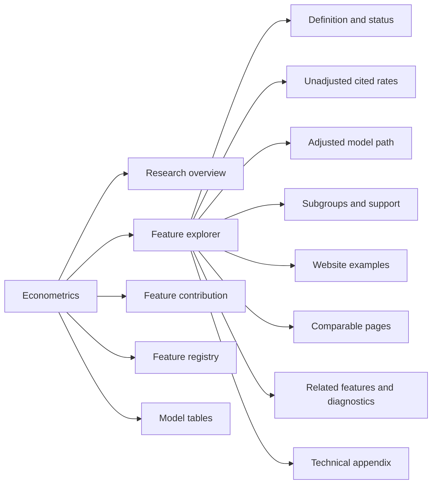

# Econometrics Frontend Product Specification

## Purpose

The frontend explains observed content-econometrics patterns for sources already surfaced in the area-condo / SCOPE-relevant nonbranded audit. Its estimand is:

`P(cited = 1 | source surfaced in this audit)`

It is a read-only research interface. Streamlit loads versioned frontend artifacts and never fits a model, reads raw Bright Data responses, changes outcomes, or performs feature extraction.

## Information Architecture

The overview starts with scope, sample, and a sortable scorecard. The explorer uses one persistent feature selector; all panels below update from that selection. Simple descriptive evidence appears before adjusted estimates. Technical formulas and p-values remain expandable.

## Supported Evidence

The first release supports features that exist in both the measured-row dataset and at least one precomputed model artifact. Model paths are normalized to G1, G2, G3, G4A, G4B, G5, G7, and G8 only where those results exist. Missing models are shown honestly.

Core-General features are the default. Vertical-specific terms remain outside the headline scorecard. `content_strength` is labeled extraction quality, never writing quality. `has_table` is labeled a legacy table proxy until HTML-aware table QA is complete.

## Component Behavior

- Percentage-point estimates and confidence intervals lead every adjusted panel.
- Wilson intervals and row/prompt/URL/domain support lead descriptive panels.
- Fixed-effect coefficients are filtered out of the feature display.
- Examples are paginated and use compact, precomputed excerpts.
- Comparable pairs are created offline with a deterministic matching hierarchy.
- Every chart carries the audit scope warning and artifact version.
- Low support, invalid intervals, missing models, and unsupported diagnostics produce visible warnings.

## Acceptance Boundary

The interface does not claim causal effects, content uplift, AI preference, or web-wide citation probability. It does not treat a non-significant subgroup difference as evidence of heterogeneity. It does not claim that observed variables explain a citation outcome.
