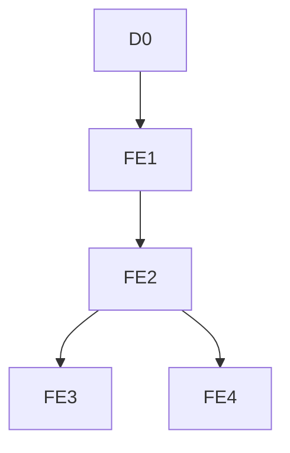

# Econometrics Pipeline Redesign v1

## Status and scope freeze

This document defines the complete redesigned econometric pipeline. The scope is frozen to exactly five analysis layers:

```text
D0 -> FE1 -> FE2
             |-> FE3
             |-> FE4
```

No analysis layer outside this sequence belongs to the redesign. Historical outputs remain archived and read-only. They are not inputs to the new model registry, flowchart, frontend navigation, or implementation plan.

The estimand is:

```text
P(cited = 1 | source surfaced in this audit)
```

The unit of observation is one `prompt_id x surfaced source appearance`. Results are observational conditional associations. They are not causal effects, web-wide citation probabilities, or evidence that changing page content will change citation outcomes.

## 1. Inputs

The redesign uses three input groups:

1. AI-search audit output containing surfaced sources and citation membership.
2. Prompt manifest containing `prompt_id` and prompt metadata.
3. Scraper output containing versioned page evidence and extraction provenance.

Answer text may be retained in a physically separate qualitative-audit artifact. It must not be present in predictor construction, taxonomy construction used by the five layers, model-ready exports, or formulas.

## 2. Data architecture

### Source-appearance table

One row per `prompt_id x surfaced source appearance`, containing:

- binary outcome `cited`;
- `prompt_id`;
- normalized URL and source root domain;
- leakage-safe prompt metadata;
- URL-content join key and content version;
- scrape and feature-availability indicators.

### URL-content table

One row per normalized URL and content version, containing:

- scrape and parse provenance;
- extraction method and content scope;
- full-page structural evidence where available;
- Core-General feature values;
- missingness and QA indicators;
- approved page-type and source-type classifications with version metadata.

The URL-content table joins many-to-one into the source-appearance table. Missing extraction must remain missing and must not be converted into measured absence.

## 3. Outcome and leakage rules

`cited` is the dependent variable only. No predictor may use:

- the outcome or any outcome-derived aggregate;
- answer text or answer-derived measurements;
- source position or observed rank;
- post-answer citation information;
- domain citation statistics.

Prompt-page metadata may use prompt text, URL, title, meta description, and page content only when the resulting feature is explicitly approved for the Core-General registry. No unapproved feature enters the five-layer pipeline.

## 4. Feature architecture

### Core-General predictors

The headline feature scope is limited to cross-industry page characteristics such as:

- page length;
- verified semantic table presence;
- heading structure;
- external evidence or outbound-link structure;
- general factual and numeric density.

The feature manifest must select one representative per construct. Near-duplicate raw, grouped, logged, density, and composite forms must not enter the same joint specification without explicit approval.

### Measurement control

`content_strength` is an extraction-quality control. It is not writing quality and must not be described as a content-quality score.

### Categorical controls

Page type and source type are categorical controls used only in `FE4`. They are not fixed effects and are not focal writing features. Their classifier version, evidence scope, confidence policy, and category-collapse rules must be recorded.

## 5. Feature approval gate

Before a feature enters `FE1` or `FE2`, the registry must confirm:

- exact definition and transformation;
- evidence source and extraction version;
- leakage-safe status;
- missing-value meaning;
- nonmissing row, prompt, URL, and domain support;
- sparse-level and perfect-prediction checks where relevant;
- sufficient within-prompt variation;
- sufficient within-domain variation when used in `FE3`;
- absence of an unresolved model-entry blocker;
- explicit human approval.

Features that fail the gate remain diagnostic fields and do not generate another analysis layer.

## 6. Fixed sequence and branching



`FE3` and `FE4` are separate branches from `FE2`:

- `FE3` adds source-root-domain fixed effects to the `FE2` specification.
- `FE4` adds page-type and source-type categorical controls to the `FE2` specification.
- `FE4` does not include domain fixed effects unless the frozen scope is changed in a new approved version.

Core features are predictors, not fixed effects. Prompt and domain indicators are fixed effects. Page type and source type are categorical controls.

## 7. Inference policy

The primary uncertainty calculation clusters standard errors by `prompt_id`. A URL-clustered calculation may be reported as an inference check when valid. Changing the covariance estimator changes uncertainty, not the conditional mean, feature set, fixed effects, or analysis-layer identity.

Therefore, a standard-error calculation never creates another model or another frontend entry.

## 8. Output contract

The redesigned output contract exposes only:

- one descriptive view for `D0`;
- one repeated one-feature view for the `FE1` family;
- one joint headline view for `FE2`;
- one domain-fixed-effect branch for `FE3`;
- one taxonomy-control branch for `FE4`.

Each regression output must store:

- exact formula and feature versions;
- sample rows, prompts, URLs, and domains;
- fixed effects and categorical controls;
- covariance method;
- reference groups;
- feature availability and dropped-row audit;
- coefficient, confidence interval, and support;
- noncausal interpretation boundary.

The frontend must display only the five layers below and must show `FE3` and `FE4` as sibling branches from `FE2`.

## 9. Implementation readiness

Implementation may begin only after:

- the five-row model registry is approved;
- the final `FE2` representative features are approved;
- the verified-table field passes extraction QA or is omitted;
- page-type and source-type provenance for `FE4` is approved;
- answer-derived fields are physically quarantined;
- reference groups and domain-support rules are frozen;
- the model-ready panel passes leakage, join, and missingness checks.

| Layer | Analysis | Predictors and controls | Fixed effects | Role |
|---|---|---|---|---|
| D0 | Descriptive analysis; no regression | Approved features summarized without adjustment | None | Descriptive foundation |
| FE1 | One focal feature per run | One approved focal Core-General feature | Prompt | Headline one-feature family |
| FE2 | Small joint Core-General LPM | Approved Core-General features plus extraction-quality control | Prompt | Headline joint model |
| FE3 | FE2 with domain adjustment | Same predictors and controls as FE2 | Prompt and domain | Domain-confounding branch |
| FE4 | FE2 with taxonomy adjustment | Same predictors as FE2 plus page-type and source-type categorical controls | Prompt | Taxonomy-control branch |
