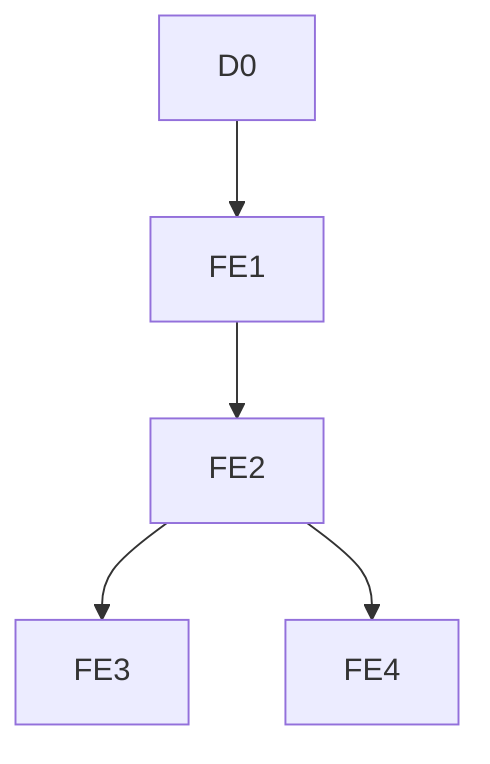

# Econometrics Pipeline Redesign v2

## Scope

The active redesign contains exactly five layers:



`D0` is descriptive, not a regression. `FE3` and `FE4` are separate branches from `FE2`. The unit is one surfaced source appearance for one prompt and the estimand is `P(cited = 1 | source surfaced in this audit)`. Results are observational conditional associations, not causal effects or web-wide probabilities.

## Governed Features

The four governed deterministic core predictors remain `log2_word_count_plus1`, `has_verified_html_table`, `factual_numeric_density_score`, and `writing_structure_score_v3`. Six manually reviewed, pre-outcome Gemini semantic presence indicators are also approved focal predictors: `has_direct_answer_gemini_v1`, `has_definition_gemini_v1`, `has_comparison_gemini_v1`, `has_steps_gemini_v1`, `has_numeric_evidence_gemini_v1`, and `has_question_heading_gemini_v1`. The v3 writing score uses HTML-first main-content list detection and remains `NA` unless all five active components are measured. `has_question_answer_structure` is excluded from the active score and LPM because it duplicated `has_faq_pattern` exactly in the governed sample. `content_strength` is an extraction-quality control in FE2-FE4. It is not writing quality. `heading_count_group` and heading primitives are D0/QA only. No heading substitute enters a regression.

Gemini semantic indicators equal `1` only when a successful classification detects the feature and `0` only when a successful classification measures it absent. Failed, partial, unavailable, and unmatched pages remain `NA`. Confidence, counts, first block IDs, and page-relative position ratios are diagnostic-only and never enter D0-FE4 formulas. Joint FE2-FE4 estimates are therefore conditional on successful semantic measurement, and their sample is reported separately.

`external_evidence_structure_score` is blocked: no canonical implemented producer, formula, or current model column was found. The older `external_evidence_score` is not substituted.

Verified HTML-table presence is nullable: `1` means measured present, `0` means measured absent, and `NA` means HTML was not measured. It is a broad structural proxy, not proof of a semantic data table.

## Taxonomy

FE4 uses `page_type_family_gemini_v1_collapsed` and `source_type_general_gemini_v1_collapsed` from `gemini_3_1_flash_lite_taxonomy_v1`. Categories with fewer than 20 URL classifications are collapsed without using the outcome; `unknown` remains explicit. Gemini used Markdown/body content where available and metadata otherwise, so FE4 is a sensitivity analysis with over-control risk.

## Execution

The offline runner is:

```bash
.venv/bin/python scripts/v2_run_redesigned_content_econometrics.py \
  --output-root outputs/econometrics_redesign_v2_20260724_structured_lists
```

It joins versioned writing, HTML-document, and Gemini-taxonomy evidence; performs model-entry and leakage gates; writes a physically restricted model-ready table; fits models offline; and creates hash-validated lightweight frontend artifacts. Streamlit never reads raw Bright Data JSON for econometric display.

## Inference

Each regression is fit once. The same model is reported with HC3, prompt-clustered, normalized-URL-clustered, and two-way prompt/URL-clustered covariance where valid. A covariance choice is not a new model layer.

| Layer | Purpose | Predictors and controls | Fixed effects |
|---|---|---|---|
| D0 | Distribution, support, missingness, raw cited-rate and extraction QA | Approved focal features, Extraction Strength, headings for QA | None |
| FE1 | One-feature conditional association | One approved focal feature per run | Prompt |
| FE2 | Headline joint Core-General association | Four deterministic core features, six Gemini semantic presence features, plus Extraction Strength | Prompt |
| FE3 | Domain/template-confounding robustness | Same predictors and control as FE2 | Prompt and domain; domains need at least two unique URLs |
| FE4 | Taxonomy-control sensitivity | Same FE2 terms plus collapsed Gemini page/source controls | Prompt |
